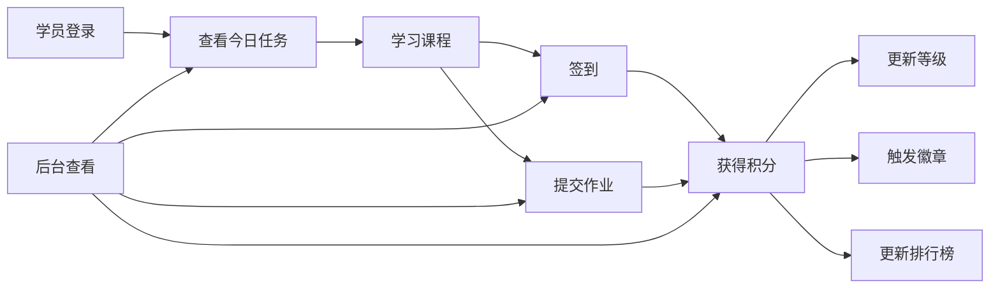

# 游戏化训练营平台 MVP V1 冻结版开发规格

> 日期：2026-06-23  
> 状态：需求冻结，进入开发准备  
> 技术栈：Next.js + TypeScript + Tailwind + Supabase(PostgreSQL/Auth/Storage) + Vercel  
> 重要约束：只开发 MVP V1；禁止新增功能；所有后续需求进入 V1.1+ Backlog。

---

## 0. MVP V1 冻结范围

### 0.1 只保留 9 个能力

1. 登录
2. 课程学习
3. 签到
4. 作业提交
5. 积分
6. 等级
7. 徽章
8. 排行榜
9. 后台查看

### 0.2 明确不做

- 不做支付、订单、退款、优惠券。
- 不做 AI 点评、AI 总结、AI 教练。
- 不做海报、证书、成长报告生成。
- 不做案例库、公开作品广场。
- 不做站内私信、社群聊天、评论区。
- 不做后台课程可视化编辑器；V1 课程和任务通过数据库种子数据维护。
- 不做老师点评工作台；后台仅查看学员、课程进度、签到、作业、积分、徽章、排行榜数据。
- 不做微信小程序；但接口命名保留未来复用空间。
- 不做多租户 SaaS 自助入驻；V1 固定为 Jenny 自用单组织。

### 0.3 V1 核心闭环



---

## 1. 数据库 SQL

### 1.1 设计原则

- 使用 Supabase Auth 负责账号登录，业务用户信息存在 `profiles`。
- V1 仍保留 `organization_id`，但只初始化一个组织，方便未来 SaaS 化。
- 所有积分通过 `point_ledger` 流水生成，不直接手改总分。
- 等级由总积分计算，不单独存最终等级；页面查询时根据 `level_rules` 推导。
- 作业允许草稿与提交，但 V1 不做老师点评状态。
- 排行榜按训练营内总积分排序；周榜通过积分流水时间窗口计算。
- 后台查看权限由 `organization_members.role` 控制。

### 1.2 枚举与扩展

```sql
create extension if not exists "pgcrypto";

create type member_role as enum ('owner', 'admin', 'assistant', 'student');
create type publish_status as enum ('draft', 'published', 'archived');
create type enrollment_status as enum ('active', 'paused', 'completed', 'removed');
create type lesson_progress_status as enum ('not_started', 'in_progress', 'completed');
create type submission_status as enum ('draft', 'submitted', 'withdrawn');
create type asset_type as enum ('image', 'video', 'audio', 'pdf', 'file', 'prompt');
create type point_event_type as enum (
  'profile_completed',
  'daily_check_in',
  'lesson_completed',
  'assignment_submitted'
);
create type badge_criteria_type as enum (
  'total_points',
  'check_in_days',
  'lesson_completed_count',
  'assignment_submitted_count'
);
```

### 1.3 基础组织与用户

```sql
create table organizations (
  id uuid primary key default gen_random_uuid(),
  name text not null,
  slug text not null unique,
  timezone text not null default 'Asia/Shanghai',
  created_at timestamptz not null default now(),
  updated_at timestamptz not null default now()
);

create table profiles (
  id uuid primary key references auth.users(id) on delete cascade,
  phone text unique,
  nickname text not null,
  avatar_url text,
  bio text,
  is_anonymous_on_leaderboard boolean not null default false,
  created_at timestamptz not null default now(),
  updated_at timestamptz not null default now()
);

create table organization_members (
  id uuid primary key default gen_random_uuid(),
  organization_id uuid not null references organizations(id) on delete cascade,
  user_id uuid not null references profiles(id) on delete cascade,
  role member_role not null default 'student',
  created_at timestamptz not null default now(),
  unique (organization_id, user_id)
);

create index idx_org_members_user on organization_members(user_id);
create index idx_org_members_org_role on organization_members(organization_id, role);
```

### 1.4 课程、课节、资源、训练营

```sql
create table courses (
  id uuid primary key default gen_random_uuid(),
  organization_id uuid not null references organizations(id) on delete cascade,
  title text not null,
  subtitle text,
  description text,
  cover_url text,
  status publish_status not null default 'draft',
  position int not null default 0,
  created_at timestamptz not null default now(),
  updated_at timestamptz not null default now()
);

create table modules (
  id uuid primary key default gen_random_uuid(),
  course_id uuid not null references courses(id) on delete cascade,
  title text not null,
  description text,
  position int not null default 0,
  created_at timestamptz not null default now(),
  updated_at timestamptz not null default now()
);

create table lessons (
  id uuid primary key default gen_random_uuid(),
  module_id uuid not null references modules(id) on delete cascade,
  title text not null,
  summary text,
  content_md text,
  estimated_minutes int not null default 10,
  position int not null default 0,
  status publish_status not null default 'published',
  created_at timestamptz not null default now(),
  updated_at timestamptz not null default now()
);

create table lesson_assets (
  id uuid primary key default gen_random_uuid(),
  lesson_id uuid not null references lessons(id) on delete cascade,
  type asset_type not null,
  title text not null,
  storage_path text,
  external_url text,
  metadata jsonb not null default '{}'::jsonb,
  position int not null default 0,
  created_at timestamptz not null default now()
);

create table camps (
  id uuid primary key default gen_random_uuid(),
  organization_id uuid not null references organizations(id) on delete cascade,
  course_id uuid not null references courses(id) on delete restrict,
  title text not null,
  description text,
  starts_at timestamptz not null,
  ends_at timestamptz,
  timezone text not null default 'Asia/Shanghai',
  status publish_status not null default 'published',
  created_at timestamptz not null default now(),
  updated_at timestamptz not null default now()
);

create table enrollments (
  id uuid primary key default gen_random_uuid(),
  camp_id uuid not null references camps(id) on delete cascade,
  user_id uuid not null references profiles(id) on delete cascade,
  status enrollment_status not null default 'active',
  enrolled_at timestamptz not null default now(),
  completed_at timestamptz,
  created_at timestamptz not null default now(),
  updated_at timestamptz not null default now(),
  unique (camp_id, user_id)
);

create index idx_courses_org_status on courses(organization_id, status);
create index idx_modules_course_position on modules(course_id, position);
create index idx_lessons_module_position on lessons(module_id, position);
create index idx_camps_org_status on camps(organization_id, status);
create index idx_enrollments_user_status on enrollments(user_id, status);
create index idx_enrollments_camp_status on enrollments(camp_id, status);
```

### 1.5 学习进度、签到、作业

```sql
create table lesson_progress (
  id uuid primary key default gen_random_uuid(),
  enrollment_id uuid not null references enrollments(id) on delete cascade,
  lesson_id uuid not null references lessons(id) on delete cascade,
  status lesson_progress_status not null default 'not_started',
  first_opened_at timestamptz,
  completed_at timestamptz,
  created_at timestamptz not null default now(),
  updated_at timestamptz not null default now(),
  unique (enrollment_id, lesson_id)
);

create table check_ins (
  id uuid primary key default gen_random_uuid(),
  enrollment_id uuid not null references enrollments(id) on delete cascade,
  local_date date not null,
  note text,
  created_at timestamptz not null default now(),
  unique (enrollment_id, local_date)
);

create table assignments (
  id uuid primary key default gen_random_uuid(),
  lesson_id uuid not null references lessons(id) on delete cascade,
  title text not null,
  description_md text not null,
  requirement_md text,
  points int not null default 10,
  is_required boolean not null default true,
  allow_text boolean not null default true,
  allow_link boolean not null default true,
  allow_file boolean not null default true,
  max_files int not null default 5,
  position int not null default 0,
  created_at timestamptz not null default now(),
  updated_at timestamptz not null default now()
);

create table submissions (
  id uuid primary key default gen_random_uuid(),
  enrollment_id uuid not null references enrollments(id) on delete cascade,
  assignment_id uuid not null references assignments(id) on delete cascade,
  status submission_status not null default 'draft',
  text_content text,
  link_url text,
  submitted_at timestamptz,
  created_at timestamptz not null default now(),
  updated_at timestamptz not null default now(),
  unique (enrollment_id, assignment_id)
);

create table submission_assets (
  id uuid primary key default gen_random_uuid(),
  submission_id uuid not null references submissions(id) on delete cascade,
  type asset_type not null,
  file_name text not null,
  storage_path text not null,
  file_size_bytes bigint,
  mime_type text,
  created_at timestamptz not null default now()
);

create index idx_lesson_progress_enrollment_status on lesson_progress(enrollment_id, status);
create index idx_check_ins_enrollment_date on check_ins(enrollment_id, local_date desc);
create index idx_assignments_lesson_position on assignments(lesson_id, position);
create index idx_submissions_enrollment_status on submissions(enrollment_id, status);
create index idx_submissions_assignment_status on submissions(assignment_id, status);
```

### 1.6 积分、等级、徽章、排行榜

```sql
create table point_rules (
  id uuid primary key default gen_random_uuid(),
  organization_id uuid not null references organizations(id) on delete cascade,
  event_type point_event_type not null,
  points int not null,
  description text not null,
  is_active boolean not null default true,
  created_at timestamptz not null default now(),
  unique (organization_id, event_type, is_active)
);

create table point_ledger (
  id uuid primary key default gen_random_uuid(),
  organization_id uuid not null references organizations(id) on delete cascade,
  camp_id uuid not null references camps(id) on delete cascade,
  enrollment_id uuid not null references enrollments(id) on delete cascade,
  user_id uuid not null references profiles(id) on delete cascade,
  event_type point_event_type not null,
  event_key text not null,
  delta int not null,
  reason text not null,
  metadata jsonb not null default '{}'::jsonb,
  created_at timestamptz not null default now(),
  unique (event_key)
);

create table level_rules (
  id uuid primary key default gen_random_uuid(),
  organization_id uuid not null references organizations(id) on delete cascade,
  level_no int not null,
  name text not null,
  min_points int not null,
  icon text,
  created_at timestamptz not null default now(),
  unique (organization_id, level_no),
  unique (organization_id, min_points)
);

create table badges (
  id uuid primary key default gen_random_uuid(),
  organization_id uuid not null references organizations(id) on delete cascade,
  name text not null,
  description text not null,
  icon_url text,
  criteria_type badge_criteria_type not null,
  criteria_value int,
  status publish_status not null default 'published',
  position int not null default 0,
  created_at timestamptz not null default now(),
  updated_at timestamptz not null default now()
);

create table badge_awards (
  id uuid primary key default gen_random_uuid(),
  organization_id uuid not null references organizations(id) on delete cascade,
  camp_id uuid not null references camps(id) on delete cascade,
  enrollment_id uuid not null references enrollments(id) on delete cascade,
  user_id uuid not null references profiles(id) on delete cascade,
  badge_id uuid not null references badges(id) on delete cascade,
  source_event_key text,
  awarded_at timestamptz not null default now(),
  unique (camp_id, user_id, badge_id)
);

create index idx_point_ledger_user_camp_time on point_ledger(user_id, camp_id, created_at desc);
create index idx_point_ledger_camp_time on point_ledger(camp_id, created_at desc);
create index idx_badge_awards_user_camp on badge_awards(user_id, camp_id);
create index idx_badges_org_position on badges(organization_id, position);
```

### 1.7 后台查看视图

```sql
create view v_enrollment_scores as
select
  e.id as enrollment_id,
  e.camp_id,
  e.user_id,
  coalesce(sum(pl.delta), 0)::int as total_points,
  count(distinct ci.local_date)::int as check_in_days,
  count(distinct lp.lesson_id) filter (where lp.status = 'completed')::int as completed_lessons,
  count(distinct s.assignment_id) filter (where s.status = 'submitted')::int as submitted_assignments
from enrollments e
left join point_ledger pl on pl.enrollment_id = e.id
left join check_ins ci on ci.enrollment_id = e.id
left join lesson_progress lp on lp.enrollment_id = e.id
left join submissions s on s.enrollment_id = e.id
group by e.id, e.camp_id, e.user_id;

create view v_current_levels as
select distinct on (ves.enrollment_id)
  ves.enrollment_id,
  ves.camp_id,
  ves.user_id,
  ves.total_points,
  lr.level_no,
  lr.name as level_name,
  lr.min_points
from v_enrollment_scores ves
join camps c on c.id = ves.camp_id
join level_rules lr
  on lr.organization_id = c.organization_id
 and lr.min_points <= ves.total_points
order by ves.enrollment_id, lr.min_points desc;

create view v_leaderboard_total as
select
  ves.camp_id,
  ves.enrollment_id,
  ves.user_id,
  p.nickname,
  p.avatar_url,
  p.is_anonymous_on_leaderboard,
  ves.total_points,
  ves.submitted_assignments,
  ves.check_in_days,
  rank() over (
    partition by ves.camp_id
    order by ves.total_points desc, ves.submitted_assignments desc, ves.check_in_days desc, ves.enrollment_id asc
  ) as rank_no
from v_enrollment_scores ves
join profiles p on p.id = ves.user_id;
```

### 1.8 初始化规则数据

```sql
insert into organizations (name, slug, timezone)
values ('Jenny 游戏化训练营', 'jenny-bootcamp', 'Asia/Shanghai')
on conflict (slug) do nothing;

insert into level_rules (organization_id, level_no, name, min_points)
select o.id, x.level_no, x.name, x.min_points
from organizations o
cross join (
  values
    (1, '觉醒者', 0),
    (2, '探索者', 100),
    (3, '架构师', 250),
    (4, '训练师', 450),
    (5, '炼金师', 700),
    (6, '创造者', 1000),
    (7, '超级个体', 1500)
) as x(level_no, name, min_points)
where o.slug = 'jenny-bootcamp';

insert into point_rules (organization_id, event_type, points, description)
select o.id, x.event_type::point_event_type, x.points, x.description
from organizations o
cross join (
  values
    ('profile_completed', 10, '首次完善个人资料'),
    ('daily_check_in', 2, '每日签到'),
    ('lesson_completed', 5, '完成课程学习'),
    ('assignment_submitted', 10, '提交作业')
) as x(event_type, points, description)
where o.slug = 'jenny-bootcamp';

insert into badges (organization_id, name, description, criteria_type, criteria_value, position)
select o.id, x.name, x.description, x.criteria_type::badge_criteria_type, x.criteria_value, x.position
from organizations o
cross join (
  values
    ('觉醒者徽章', '完成首次课程学习', 'lesson_completed_count', 1, 1),
    ('人生架构师', '累计完成 5 节课程', 'lesson_completed_count', 5, 2),
    ('项目猎人', '累计提交 3 次作业', 'assignment_submitted_count', 3, 3),
    ('知识炼金师', '累计提交 5 次作业', 'assignment_submitted_count', 5, 4),
    ('数字分身创造者', '累计获得 700 积分', 'total_points', 700, 5),
    ('内容创造者', '累计获得 1000 积分', 'total_points', 1000, 6),
    ('坚持王', '累计签到 7 天', 'check_in_days', 7, 7),
    ('超级个体', '累计获得 1500 积分', 'total_points', 1500, 8)
) as x(name, description, criteria_type, criteria_value, position)
where o.slug = 'jenny-bootcamp';
```

### 1.9 最小 RLS 策略

V1 建议开启 RLS。学生只能看自己的数据和公开课程；后台角色可查看所属组织数据。

```sql
alter table profiles enable row level security;
alter table organization_members enable row level security;
alter table courses enable row level security;
alter table modules enable row level security;
alter table lessons enable row level security;
alter table lesson_assets enable row level security;
alter table camps enable row level security;
alter table enrollments enable row level security;
alter table lesson_progress enable row level security;
alter table check_ins enable row level security;
alter table assignments enable row level security;
alter table submissions enable row level security;
alter table submission_assets enable row level security;
alter table point_ledger enable row level security;
alter table level_rules enable row level security;
alter table badges enable row level security;
alter table badge_awards enable row level security;

create policy "profiles_self_read"
on profiles for select
using (id = auth.uid());

create policy "profiles_self_update"
on profiles for update
using (id = auth.uid());

create policy "members_self_read"
on organization_members for select
using (user_id = auth.uid());

create policy "enrollments_self_read"
on enrollments for select
using (user_id = auth.uid());

create policy "student_read_own_progress"
on lesson_progress for select
using (
  exists (
    select 1 from enrollments e
    where e.id = lesson_progress.enrollment_id
      and e.user_id = auth.uid()
  )
);

create policy "student_read_own_checkins"
on check_ins for select
using (
  exists (
    select 1 from enrollments e
    where e.id = check_ins.enrollment_id
      and e.user_id = auth.uid()
  )
);

create policy "student_read_own_submissions"
on submissions for select
using (
  exists (
    select 1 from enrollments e
    where e.id = submissions.enrollment_id
      and e.user_id = auth.uid()
  )
);

create policy "student_read_own_points"
on point_ledger for select
using (user_id = auth.uid());

create policy "student_read_own_badges"
on badge_awards for select
using (user_id = auth.uid());
```

> 说明：写入类操作建议通过 Next.js Route Handler 使用 Supabase service role 在服务端执行，避免前端直接写积分、徽章等关键数据。

---

## 2. API 设计

### 2.1 API 分层

- 客户端页面读取：优先使用 Server Components + Supabase 查询。
- 关键写入：使用 Next.js Route Handlers。
- 积分与徽章：所有相关写入必须走服务端领域函数。
- 后台查看：服务端校验 `owner/admin/assistant` 后返回数据。

### 2.2 通用响应结构

```ts
type ApiSuccess<T> = {
  ok: true;
  data: T;
};

type ApiError = {
  ok: false;
  error: {
    code: string;
    message: string;
  };
};
```

### 2.3 登录与用户

| 方法 | 路径 | 说明 |
|---|---|---|
| `POST` | `/api/auth/profile` | 首次登录后创建/更新资料 |
| `GET` | `/api/me` | 获取当前用户、角色、当前训练营 |

#### `POST /api/auth/profile`

请求：

```json
{
  "nickname": "Jenny",
  "avatarUrl": "https://...",
  "bio": "AI人生操作系统创造营学员"
}
```

响应：

```json
{
  "ok": true,
  "data": {
    "userId": "uuid",
    "nickname": "Jenny",
    "profileCompleted": true
  }
}
```

副作用：

- 若首次完善资料，写入 `profiles`。
- 发放 `profile_completed` 积分，使用 event_key：`profile_completed:{userId}`。

### 2.4 学员首页

| 方法 | 路径 | 说明 |
|---|---|---|
| `GET` | `/api/student/home` | 首页聚合数据 |

响应字段：

```json
{
  "ok": true,
  "data": {
    "camp": {
      "id": "uuid",
      "title": "AI人生操作系统创造营",
      "dayNo": 6
    },
    "profile": {
      "nickname": "Jenny",
      "avatarUrl": null
    },
    "score": {
      "totalPoints": 268,
      "levelNo": 2,
      "levelName": "探索者",
      "nextLevelName": "架构师",
      "pointsToNextLevel": 32
    },
    "today": {
      "checkedIn": true,
      "primaryAction": {
        "type": "lesson",
        "lessonId": "uuid",
        "title": "绘制价值观地图",
        "buttonText": "继续学习"
      }
    },
    "badges": {
      "latest": {
        "name": "坚持王",
        "iconUrl": null
      }
    }
  }
}
```

### 2.5 课程学习

| 方法 | 路径 | 说明 |
|---|---|---|
| `GET` | `/api/camps/:campId/course` | 获取课程路径、模块、课节、完成状态 |
| `GET` | `/api/lessons/:lessonId` | 获取课节详情与资源 |
| `POST` | `/api/lessons/:lessonId/open` | 记录首次打开 |
| `POST` | `/api/lessons/:lessonId/complete` | 标记课程完成并发积分 |

#### `POST /api/lessons/:lessonId/complete`

请求：

```json
{
  "campId": "uuid"
}
```

响应：

```json
{
  "ok": true,
  "data": {
    "lessonId": "uuid",
    "status": "completed",
    "pointsAdded": 5,
    "totalPoints": 273,
    "newBadges": []
  }
}
```

副作用：

- `lesson_progress.status = completed`
- 发放 `lesson_completed` 积分，event_key：`lesson_completed:{enrollmentId}:{lessonId}`
- 检查徽章：课程完成数量类、积分类

### 2.6 签到

| 方法 | 路径 | 说明 |
|---|---|---|
| `POST` | `/api/check-ins` | 今日签到 |
| `GET` | `/api/check-ins` | 查看我的签到记录 |

#### `POST /api/check-ins`

请求：

```json
{
  "campId": "uuid",
  "note": "今天完成了价值观地图"
}
```

响应：

```json
{
  "ok": true,
  "data": {
    "localDate": "2026-06-23",
    "alreadyCheckedIn": false,
    "pointsAdded": 2,
    "checkInDays": 7,
    "newBadges": [
      {
        "name": "坚持王"
      }
    ]
  }
}
```

幂等规则：

- 同一 `enrollment_id + local_date` 只允许一条。
- 重复签到返回 `alreadyCheckedIn: true`，不重复发积分。

### 2.7 作业提交

| 方法 | 路径 | 说明 |
|---|---|---|
| `GET` | `/api/assignments/:assignmentId` | 获取作业要求、我的草稿/提交 |
| `POST` | `/api/submissions/draft` | 保存草稿 |
| `POST` | `/api/submissions/submit` | 正式提交 |
| `POST` | `/api/submission-assets/upload-url` | 获取附件上传路径 |

#### `POST /api/submissions/draft`

请求：

```json
{
  "campId": "uuid",
  "assignmentId": "uuid",
  "textContent": "我的价值观地图说明...",
  "linkUrl": "https://..."
}
```

响应：

```json
{
  "ok": true,
  "data": {
    "submissionId": "uuid",
    "status": "draft",
    "savedAt": "2026-06-23T10:00:00Z"
  }
}
```

#### `POST /api/submissions/submit`

请求：

```json
{
  "campId": "uuid",
  "assignmentId": "uuid",
  "textContent": "最终作业内容...",
  "linkUrl": "https://...",
  "assetIds": ["uuid"]
}
```

响应：

```json
{
  "ok": true,
  "data": {
    "submissionId": "uuid",
    "status": "submitted",
    "pointsAdded": 10,
    "totalPoints": 283,
    "newBadges": []
  }
}
```

副作用：

- 新建或更新 `submissions`
- 发放 `assignment_submitted` 积分，event_key：`assignment_submitted:{enrollmentId}:{assignmentId}`
- 检查徽章：作业提交数量类、积分类

### 2.8 积分、等级、徽章

| 方法 | 路径 | 说明 |
|---|---|---|
| `GET` | `/api/growth/summary` | 学员中心汇总 |
| `GET` | `/api/points` | 积分流水 |
| `GET` | `/api/levels` | 等级规则与当前等级 |
| `GET` | `/api/badges` | 徽章墙 |

#### `GET /api/growth/summary`

响应包含：

- 总积分
- 当前等级
- 下一等级差值
- 已获徽章数
- 课程完成数
- 作业提交数
- 签到天数

### 2.9 排行榜

| 方法 | 路径 | 说明 |
|---|---|---|
| `GET` | `/api/leaderboard?campId=:id&period=total` | 总榜 |
| `GET` | `/api/leaderboard?campId=:id&period=week` | 周榜 |

响应：

```json
{
  "ok": true,
  "data": {
    "period": "total",
    "me": {
      "rankNo": 5,
      "totalPoints": 268
    },
    "items": [
      {
        "rankNo": 1,
        "displayName": "林晓",
        "avatarUrl": null,
        "totalPoints": 345,
        "submittedAssignments": 6,
        "checkInDays": 9
      }
    ]
  }
}
```

匿名规则：

- 若 `profiles.is_anonymous_on_leaderboard = true`，展示名返回 `匿名学员`。

### 2.10 后台查看

后台只读，不提供编辑。

| 方法 | 路径 | 说明 |
|---|---|---|
| `GET` | `/api/admin/overview` | 运营总览 |
| `GET` | `/api/admin/students` | 学员列表 |
| `GET` | `/api/admin/students/:userId` | 学员详情 |
| `GET` | `/api/admin/submissions` | 作业提交列表 |
| `GET` | `/api/admin/check-ins` | 签到记录 |
| `GET` | `/api/admin/leaderboard` | 排行榜查看 |

权限：

- `owner/admin/assistant` 可访问。
- `student` 禁止访问。
- 所有后台接口服务端校验角色，不依赖前端隐藏菜单。

---

## 3. 页面路由

### 3.1 学员端移动优先路由

```text
/
└── /login                         登录页

/app
├── /home                          首页：今日任务、签到入口、积分等级摘要
├── /course                        课程路径页
├── /course/[lessonId]             课节详情页
├── /assignments/[assignmentId]    作业提交页
├── /growth                        学员中心
├── /growth/points                 积分流水
├── /growth/levels                 等级页
├── /growth/badges                 徽章页
├── /leaderboard                   排行榜
└── /profile                       我的资料与排行榜匿名设置
```

底部导航：

```text
首页 / 课程 / 成长 / 排行榜 / 我的
```

路由映射：

- 首页 → `/app/home`
- 课程 → `/app/course`
- 成长 → `/app/growth`
- 排行榜 → `/app/leaderboard`
- 我的 → `/app/profile`

### 3.2 后台只读路由

```text
/admin
├── /overview                      运营总览
├── /students                      学员列表
├── /students/[userId]             学员详情
├── /submissions                   作业提交列表
├── /check-ins                     签到记录
└── /leaderboard                   排行榜查看
```

### 3.3 页面与数据对应

| 页面 | 主要 API | 核心数据 |
|---|---|---|
| `/login` | Supabase Auth | 手机/验证码或邮箱魔法链接 |
| `/app/home` | `/api/student/home` | 当前训练营、今日行动、积分等级、最新徽章 |
| `/app/course` | `/api/camps/:campId/course` | 模块、课节、完成状态 |
| `/app/course/[lessonId]` | `/api/lessons/:lessonId` | 课节内容、资源、作业入口 |
| `/app/assignments/[assignmentId]` | `/api/assignments/:assignmentId` | 作业要求、草稿、附件 |
| `/app/growth` | `/api/growth/summary` | 积分、等级、徽章、学习统计 |
| `/app/growth/points` | `/api/points` | 积分流水 |
| `/app/growth/badges` | `/api/badges` | 已获/未获徽章 |
| `/app/leaderboard` | `/api/leaderboard` | 总榜/周榜 |
| `/admin/overview` | `/api/admin/overview` | 学员数、提交数、签到数、积分分布 |
| `/admin/students` | `/api/admin/students` | 学员列表和进度 |
| `/admin/submissions` | `/api/admin/submissions` | 作业提交列表 |

---

## 4. 项目目录结构

```text
gamified-bootcamp/
├── app/
│   ├── (auth)/
│   │   └── login/
│   │       └── page.tsx
│   ├── (student)/
│   │   └── app/
│   │       ├── layout.tsx
│   │       ├── home/
│   │       │   └── page.tsx
│   │       ├── course/
│   │       │   ├── page.tsx
│   │       │   └── [lessonId]/
│   │       │       └── page.tsx
│   │       ├── assignments/
│   │       │   └── [assignmentId]/
│   │       │       └── page.tsx
│   │       ├── growth/
│   │       │   ├── page.tsx
│   │       │   ├── points/
│   │       │   │   └── page.tsx
│   │       │   ├── levels/
│   │       │   │   └── page.tsx
│   │       │   └── badges/
│   │       │       └── page.tsx
│   │       ├── leaderboard/
│   │       │   └── page.tsx
│   │       └── profile/
│   │           └── page.tsx
│   ├── admin/
│   │   ├── layout.tsx
│   │   ├── overview/
│   │   │   └── page.tsx
│   │   ├── students/
│   │   │   ├── page.tsx
│   │   │   └── [userId]/
│   │   │       └── page.tsx
│   │   ├── submissions/
│   │   │   └── page.tsx
│   │   ├── check-ins/
│   │   │   └── page.tsx
│   │   └── leaderboard/
│   │       └── page.tsx
│   ├── api/
│   │   ├── auth/profile/route.ts
│   │   ├── me/route.ts
│   │   ├── student/home/route.ts
│   │   ├── camps/[campId]/course/route.ts
│   │   ├── lessons/[lessonId]/route.ts
│   │   ├── lessons/[lessonId]/open/route.ts
│   │   ├── lessons/[lessonId]/complete/route.ts
│   │   ├── check-ins/route.ts
│   │   ├── assignments/[assignmentId]/route.ts
│   │   ├── submissions/draft/route.ts
│   │   ├── submissions/submit/route.ts
│   │   ├── submission-assets/upload-url/route.ts
│   │   ├── growth/summary/route.ts
│   │   ├── points/route.ts
│   │   ├── levels/route.ts
│   │   ├── badges/route.ts
│   │   ├── leaderboard/route.ts
│   │   └── admin/
│   │       ├── overview/route.ts
│   │       ├── students/route.ts
│   │       ├── students/[userId]/route.ts
│   │       ├── submissions/route.ts
│   │       ├── check-ins/route.ts
│   │       └── leaderboard/route.ts
│   ├── globals.css
│   └── layout.tsx
├── components/
│   ├── ui/
│   │   ├── Button.tsx
│   │   ├── Card.tsx
│   │   ├── Badge.tsx
│   │   ├── ProgressBar.tsx
│   │   ├── Tabs.tsx
│   │   ├── EmptyState.tsx
│   │   └── LoadingSkeleton.tsx
│   ├── student/
│   │   ├── BottomNav.tsx
│   │   ├── TodayActionCard.tsx
│   │   ├── CoursePath.tsx
│   │   ├── LessonContent.tsx
│   │   ├── AssignmentForm.tsx
│   │   ├── GrowthSummaryCard.tsx
│   │   ├── BadgeGrid.tsx
│   │   └── LeaderboardList.tsx
│   └── admin/
│       ├── AdminSidebar.tsx
│       ├── MetricCard.tsx
│       ├── StudentsTable.tsx
│       ├── SubmissionsTable.tsx
│       └── AdminFilters.tsx
├── lib/
│   ├── supabase/
│   │   ├── client.ts
│   │   ├── server.ts
│   │   └── service.ts
│   ├── auth/
│   │   ├── require-user.ts
│   │   └── require-admin.ts
│   ├── domain/
│   │   ├── points.ts
│   │   ├── badges.ts
│   │   ├── levels.ts
│   │   ├── course-progress.ts
│   │   ├── check-ins.ts
│   │   └── submissions.ts
│   ├── queries/
│   │   ├── student-home.ts
│   │   ├── course.ts
│   │   ├── growth.ts
│   │   ├── leaderboard.ts
│   │   └── admin.ts
│   ├── validators/
│   │   ├── profile.ts
│   │   ├── check-in.ts
│   │   └── submission.ts
│   └── constants/
│       ├── routes.ts
│       └── theme.ts
├── supabase/
│   ├── migrations/
│   │   └── 0001_mvp_v1_schema.sql
│   └── seed.sql
├── public/
│   └── brand/
├── docs/
│   └── mvp-v1-freeze.md
├── middleware.ts
├── next.config.ts
├── tailwind.config.ts
├── tsconfig.json
└── package.json
```

---

## 5. 开发任务拆解（按开发顺序）

### 阶段 0：项目基建

#### Task 0.1 初始化工程

目标：

- 创建 Next.js + TypeScript + Tailwind 项目。
- 接入 Supabase 环境变量。
- 建立 Vercel 部署配置。

验收：

- 本地启动成功。
- 首页可访问。
- Tailwind 样式生效。
- Vercel 预览部署成功。

#### Task 0.2 设计系统基础

目标：

- 固化 A 方案视觉令牌。
- 建立基础 UI 组件。

组件：

- Button
- Card
- Badge
- ProgressBar
- Tabs
- EmptyState
- LoadingSkeleton

验收：

- 颜色使用已确认 A 方案：森林绿、行动绿、成长金、浅暖灰。
- 移动端 375px 无横向滚动。

### 阶段 1：数据库与权限

#### Task 1.1 建立 Supabase Schema

目标：

- 执行 `0001_mvp_v1_schema.sql`。
- 创建所有 V1 表、索引、视图、枚举。

验收：

- 数据库迁移无报错。
- 可插入组织、等级规则、积分规则、徽章规则。

#### Task 1.2 初始化 Seed 数据

目标：

- 创建 Jenny 默认组织。
- 创建 V1 等级规则。
- 创建 V1 积分规则。
- 创建 V1 徽章规则。
- 创建一套示例课程、课节、作业、训练营。

验收：

- 新用户加入训练营后可以看到课程路径。
- 后台能看到训练营和课程基础数据。

#### Task 1.3 权限与角色

目标：

- 配置 Supabase Auth。
- 建立 `profiles` 与 `organization_members`。
- 实现学生/后台角色校验。

验收：

- 未登录访问学生页跳转登录。
- 学生访问 `/admin/*` 被拒绝。
- owner/admin/assistant 可访问后台查看页。

### 阶段 2：登录与个人资料

#### Task 2.1 登录页

目标：

- 实现 `/login`。
- 支持 Supabase 登录方式。
- 登录后进入 `/app/home`。

验收：

- 新用户首次登录后能进入资料补全流程。
- 已登录用户再次访问 `/login` 自动跳转首页。

#### Task 2.2 个人资料

目标：

- 实现 `/app/profile`。
- 支持昵称、头像、排行榜匿名开关。
- 首次完善资料发放积分。

验收：

- 修改昵称后排行榜展示更新。
- 首次完善资料只发一次积分。

### 阶段 3：学生首页与课程学习

#### Task 3.1 学生首页聚合 API

目标：

- 实现 `/api/student/home`。
- 返回今日主任务、积分、等级、最新徽章。

验收：

- 无课程时显示空状态。
- 有课程时首页只突出一个主行动。

#### Task 3.2 首页 UI

目标：

- 实现 `/app/home`。
- 复刻确认原型中的 A 方案排版。

验收：

- 首屏可看到训练营、进度、今日行动、积分等级摘要。
- 主按钮 1 次点击进入课程或作业。

#### Task 3.3 课程路径页

目标：

- 实现 `/app/course`。
- 展示模块、课节、完成状态。

验收：

- 已完成、当前、未完成状态清晰。
- 点击课节进入详情。

#### Task 3.4 课节详情页

目标：

- 实现 `/app/course/[lessonId]`。
- 展示图文、视频/音频/PDF/附件/Prompt 资源入口。
- 支持“完成学习”。

验收：

- 首次打开记录 `first_opened_at`。
- 点击完成后只发一次课程完成积分。

### 阶段 4：签到

#### Task 4.1 签到 API

目标：

- 实现 `/api/check-ins`。
- 按训练营时区计算自然日。
- 签到后发积分并检查徽章。

验收：

- 同一天重复签到不重复发积分。
- 签到 7 天获得“坚持王”。

#### Task 4.2 签到入口 UI

目标：

- 在首页增加签到状态与按钮。
- 在成长页显示累计签到天数。

验收：

- 今日已签到显示完成态。
- 网络错误不清空用户输入。

### 阶段 5：作业提交

#### Task 5.1 作业详情 API

目标：

- 实现 `/api/assignments/:assignmentId`。
- 返回作业要求、允许类型、我的草稿/提交。

验收：

- 只有已报名学员能读取自己的作业状态。

#### Task 5.2 草稿保存

目标：

- 实现 `/api/submissions/draft`。
- 支持文字、链接保存。

验收：

- 返回保存时间。
- 重新进入页面能恢复草稿。

#### Task 5.3 附件上传

目标：

- 建立 Supabase Storage bucket。
- 实现上传 URL 或服务端上传路径登记。
- 写入 `submission_assets`。

验收：

- 支持图片、视频、音频、PDF、文件。
- 未完成上传时禁止正式提交。

#### Task 5.4 正式提交

目标：

- 实现 `/api/submissions/submit`。
- 提交后发作业积分并检查徽章。

验收：

- 同一作业重复提交不重复发积分。
- 提交后状态变为 `submitted`。

#### Task 5.5 作业提交页 UI

目标：

- 实现 `/app/assignments/[assignmentId]`。
- 保持原型的任务要求、文本区、附件区、链接区、提交按钮。

验收：

- 375px 移动端可完整提交。
- 必填校验明确。
- 保存/提交/上传状态有反馈。

### 阶段 6：积分、等级、徽章

#### Task 6.1 积分领域服务

目标：

- 封装发积分函数。
- 使用 event_key 保证幂等。

验收：

- 重复调用不会重复加分。
- 积分流水可追踪事件来源。

#### Task 6.2 等级计算

目标：

- 根据总积分与 `level_rules` 计算当前等级。
- 返回下一等级差值。

验收：

- 0 分为 Lv1 觉醒者。
- 100 分为 Lv2 探索者。
- 临界值计算正确。

#### Task 6.3 徽章授予

目标：

- 封装徽章检查函数。
- 支持积分、签到天数、课程完成数、作业提交数四类自动条件。

验收：

- 同一徽章同一训练营只授予一次。
- 新获徽章能在接口响应中返回。

#### Task 6.4 成长中心与积分页

目标：

- 实现 `/app/growth` 与 `/app/growth/points`。

验收：

- 展示总积分、等级、下一等级进度、签到、课程、作业统计。
- 积分流水按时间倒序展示。

#### Task 6.5 等级页与徽章页

目标：

- 实现 `/app/growth/levels`。
- 实现 `/app/growth/badges`。

验收：

- 等级 1-7 清晰展示。
- 徽章展示已获得/未获得/获得条件。

### 阶段 7：排行榜

#### Task 7.1 排行榜 API

目标：

- 实现 `/api/leaderboard`。
- 支持总榜与周榜。

验收：

- 总榜按总积分排序。
- 周榜按本周积分流水排序。
- 同分按提交作业数、签到天数排序。
- 支持匿名展示。

#### Task 7.2 排行榜 UI

目标：

- 实现 `/app/leaderboard`。
- 保持原型中的前三名、我的排名、附近排名结构。

验收：

- 默认突出我的排名。
- 不制造末位羞辱。
- 周榜/总榜切换可用。

### 阶段 8：后台查看

#### Task 8.1 后台布局与权限

目标：

- 实现 `/admin` 布局。
- 建立后台侧边栏。
- 所有后台页面服务端校验角色。

验收：

- 学生无法访问后台。
- 后台角色刷新页面仍可访问。

#### Task 8.2 运营总览

目标：

- 实现 `/admin/overview` 与 `/api/admin/overview`。

展示：

- 学员总数
- 今日签到数
- 课程完成数
- 作业提交数
- 总积分分布
- 徽章发放数

验收：

- 数据与数据库抽样查询一致。

#### Task 8.3 学员查看

目标：

- 实现 `/admin/students` 与 `/admin/students/[userId]`。

展示：

- 昵称
- 手机
- 总积分
- 当前等级
- 签到天数
- 课程完成数
- 作业提交数
- 徽章数

验收：

- 可按关键词搜索。
- 可按等级筛选。

#### Task 8.4 作业与签到查看

目标：

- 实现 `/admin/submissions`。
- 实现 `/admin/check-ins`。

验收：

- 可查看作业内容、链接、附件列表。
- 可查看每日签到记录。
- 不提供点评、修改、删除操作。

#### Task 8.5 后台排行榜查看

目标：

- 实现 `/admin/leaderboard`。

验收：

- 后台可查看完整榜单。
- 展示匿名设置，但后台仍可识别真实学员。

### 阶段 9：联调、测试、上线

#### Task 9.1 核心链路测试

测试链路：

1. 新用户登录。
2. 完善资料。
3. 查看首页。
4. 打开课程。
5. 完成课节。
6. 签到。
7. 提交作业。
8. 查看积分、等级、徽章。
9. 查看排行榜。
10. 后台查看该学员数据。

验收：

- 全链路无阻断。
- 积分不重复发放。
- 徽章不重复授予。

#### Task 9.2 移动端适配

验收设备宽度：

- 375px
- 390px
- 414px
- 768px

验收：

- 学员端无横向滚动。
- 主按钮点击区域不小于 44px。
- 表单输入不被底部导航遮挡。

#### Task 9.3 安全与权限测试

验收：

- 未登录不能访问业务页。
- 学生不能访问后台。
- 学生不能读取他人作业。
- 学生不能伪造积分、徽章。
- 后台接口必须校验角色。

#### Task 9.4 上线准备

验收：

- 生产环境变量配置完成。
- Supabase Storage bucket 权限配置完成。
- Vercel 部署成功。
- Seed 数据导入完成。
- Jenny 测试账号和后台账号可用。

---

## 6. 开发顺序总表

| 顺序 | 阶段 | 产出 | 依赖 |
|---:|---|---|---|
| 0 | 项目基建 | Next.js/Tailwind/Supabase/Vercel | 无 |
| 1 | 数据库与权限 | Schema、Seed、RLS、角色 | 0 |
| 2 | 登录与资料 | 登录、profile、角色识别 | 1 |
| 3 | 首页与课程 | 今日行动、课程路径、课节详情 | 2 |
| 4 | 签到 | 每日签到、签到积分、坚持王徽章 | 3 |
| 5 | 作业提交 | 草稿、附件、正式提交、作业积分 | 3 |
| 6 | 积分等级徽章 | 流水、等级、徽章墙、成长中心 | 4、5 |
| 7 | 排行榜 | 总榜、周榜、匿名展示 | 6 |
| 8 | 后台查看 | 总览、学员、作业、签到、排行榜 | 3-7 |
| 9 | 联调上线 | 测试、权限、安全、部署 | 0-8 |

---

## 7. 冻结验收清单

- [ ] 登录可用。
- [ ] 首页能显示今日主任务。
- [ ] 课程路径能展示模块与课节。
- [ ] 课节能打开并标记完成。
- [ ] 今日签到只能成功一次。
- [ ] 作业可以保存草稿。
- [ ] 作业可以正式提交。
- [ ] 积分通过流水生成，重复事件不重复加分。
- [ ] 等级按照 Lv1-Lv7 自动计算。
- [ ] 徽章按照冻结规则自动授予。
- [ ] 排行榜支持总榜与周榜。
- [ ] 后台可以查看总览、学员、作业、签到、排行榜。
- [ ] 后台没有新增/编辑/点评/删除等管理功能。
- [ ] 无 AI、海报、证书、案例库、支付、小程序功能入口。

---

## 8. V1.1+ Backlog 暂存区

以下内容不进入 V1，只做记录：

- 老师点评工作台。
- AI 点评与总结。
- 海报、证书、成长报告。
- 案例库。
- 课程后台编辑器。
- 邀请码与批量导入。
- 微信小程序。
- 支付与 SaaS 多租户。
