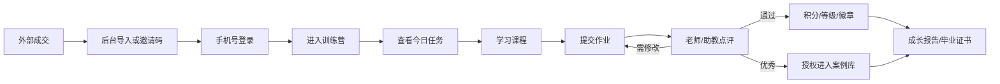
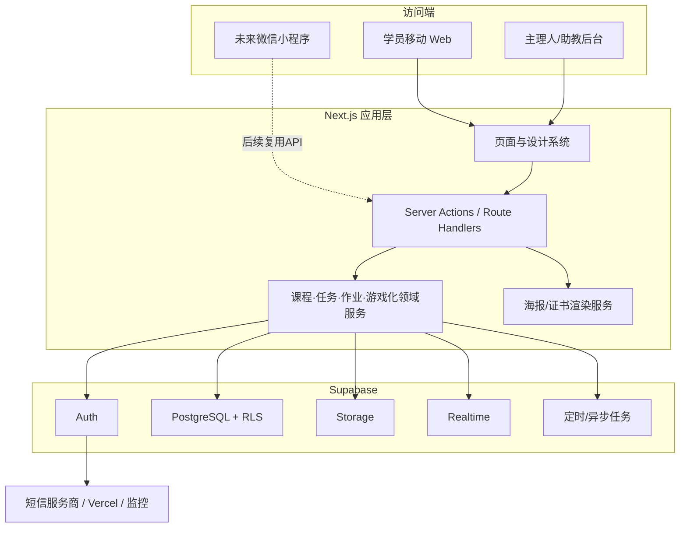
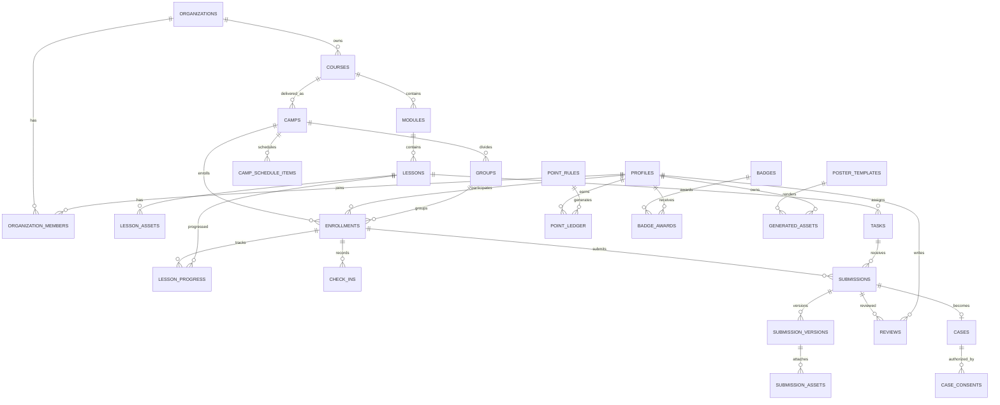

# 游戏化训练营平台产品方案（V1.0）

> 产品负责人：Jenny  
> 文档日期：2026-06-23  
> 产品阶段：MVP 规划  
> 核心假设：首版为珍妮自用单租户，首期 100 人内、1–3 个并行训练营；兼容统一开营与随到随学；外部收款后通过邀请码或后台导入入营；手机号验证码登录。

## 第一部分：产品定位分析

### 1.1 一句话定位

面向知识付费训练营的“成果驱动型游戏化学习平台”：用课程、任务、点评、积分、徽章、排行榜与可传播的成长成果，把微信群里的短期热闹转化为可追踪、可复用、可展示的学习成果。

### 1.2 目标用户与核心问题

| 用户 | 核心问题 | 平台价值 |
|---|---|---|
| 学员 | 不知道今天做什么、容易中断、成果不可见 | 清晰行动路径、即时反馈、成长可视化、成果资产化 |
| 主理人 | 运营靠人盯、作业散落、难判断谁需要帮助 | 标准化开营、任务与激励配置、点评工作台、数据预警 |
| 助教 | 信息分散、重复催交、优秀案例难沉淀 | 集中审核、批量筛选、结构化点评、案例一键入库 |
| 未来知识付费老师 | 缺少低门槛的游戏化训练营工具 | 可复制课程模板、品牌化交付、数据化运营 |

### 1.3 产品差异化

1. **成果优先，而非签到优先**：北极星指标为“优秀成果产出率”，签到和积分只是促成高质量作业的手段。
2. **训练营原生，而非通用内容平台**：围绕“开营—行动—提交—点评—展示—毕业”设计完整闭环。
3. **游戏化可解释**：每一分、每枚徽章均可追溯来源；避免单纯刷签到导致积分失真。
4. **个人成长叙事**：等级名称、徽章和海报与“AI 人生操作系统”课程世界观一致。
5. **先验证再 SaaS 化**：MVP 单租户快速上线，数据模型保留未来组织隔离与多品牌扩展点。

### 1.4 北极星指标与指标树

**北极星指标：优秀成果产出率 = 被标记为优秀案例的有效作业数 / 应提交作业人数。**

配套指标：

- 激活：入营 48 小时内完成首次登录、查看第一课、完成首个任务的比例。
- 行动：任务按时提交率、周作业完成率、连续有效学习天数。
- 质量：优秀作业率、首次提交通过率、修改后通过率、点评覆盖率。
- 留存：第 7 日与第 14 日有效学习留存、结营完成率。
- 运营：平均首次点评时长、待点评积压量、风险学员占比。
- 传播：海报生成率、分享意愿点击率（MVP 只记录生成与复制文案，不追踪微信外部传播）。

### 1.5 MVP边界

**纳入**：手机号登录、课程与内容、两种开营模式、签到、作业、点评、积分流水、等级、徽章、排行榜、案例库、基础数据看板、海报/证书生成、学员与角色管理。

**不纳入**：平台内支付、退款与订单、主理人自助入驻、套餐计费、多品牌装修、复杂社群聊天、直播、AI 自动点评、微信消息自动触达、小程序。AI 与 SaaS 能力列入后续迭代。

---

## 第二部分：竞品分析

### 2.1 竞品矩阵

| 产品类型 | 代表产品 | 优势 | 训练营短板 | 本产品策略 |
|---|---|---|---|---|
| 知识店铺/课程交付 | 小鹅通等 | 内容、交易、营销、直播能力完整 | 游戏化成长叙事弱，复杂度较高 | 不做首版交易，专注行动与成果 |
| 私域协作 | 微信群、飞书 | 触达及时、沟通自然、协作灵活 | 内容与作业分散，进度难追踪，数据不可复用 | 平台承载结构化学习，微信负责通知与关系 |
| 知识社群 | 知识星球 | 社区沉淀、付费圈层、内容互动 | 课程路径、批次节奏和毕业机制较弱 | 强化批次、任务、点评、毕业闭环 |
| 行为养成 | Duolingo、Keep | 连续激励、即时反馈、成长可视化强 | 不适配老师点评、复杂作业和案例沉淀 | 借鉴 streak、等级与里程碑，不照搬刷题逻辑 |
| 训练营/航海类 | 各类航海与打卡工具 | 共同目标、每日行动、同伴氛围强 | 常依赖人工运营，工具碎片化 | 将运营 SOP 产品化、规则化、数据化 |

### 2.2 可借鉴与应避免

**可借鉴**：首屏明确“今天做什么”；小步任务与即时反馈；连续行动保护；里程碑庆祝；同层级排行榜；真实成果展示；结营仪式感。

**应避免**：只按签到次数排名；排行榜长期固化导致新手放弃；奖励规则频繁变动；徽章过多而失去意义；用红点制造焦虑；自动 AI 评分直接替代老师判断。

### 2.3 市场空位

市场已有“卖课工具”“社群工具”和“打卡工具”，但缺少同时具备结构化训练营、复杂作业、人工点评、成果案例库与品牌化游戏叙事的轻量产品。首版应占据“训练营成果操作系统”而非“另一个课程播放器”的位置。

---

## 第三部分：完整 PRD

### 3.1 产品目标

- 学员进入首页 10 秒内知道今天最重要的一项行动。
- 每份作业状态清晰：草稿、已提交、待点评、需修改、已通过、优秀案例。
- 积分与徽章可追溯，不因重复提交、补签到或管理员操作产生歧义。
- 主理人可在一个工作台完成建营、发布、点评、预警和复盘。
- 首期结束后可导出学员成果与训练营核心数据。

### 3.2 角色与权限

| 能力 | 学员 | 助教 | 主理人 | 系统管理员 |
|---|:---:|:---:|:---:|:---:|
| 学习与提交 | 自己 | 可预览 | 可预览 | 可预览 |
| 点评作业 | — | 指定训练营 | 全部 | 全部 |
| 标记优秀案例 | — | 可建议/按授权执行 | 可执行 | 可执行 |
| 课程/任务配置 | — | 只读 | 可编辑发布 | 可编辑发布 |
| 积分与徽章规则 | — | 只读 | 可配置 | 可配置 |
| 学员管理 | 自己资料 | 查看与标签 | 导入、移除、分组 | 全部 |
| 数据看板 | 个人 | 所属训练营 | 全部训练营 | 全部 |
| 角色管理 | — | — | 助教与学员 | 全部 |

权限采用最小授权；助教必须绑定具体训练营。所有人工加减分、优秀案例调整和角色变化写入审计日志。

### 3.3 核心业务对象

- **课程模板**：可复用的章节、课节和任务集合。
- **训练营批次**：课程模板的一次交付实例，分“统一开营”或“随到随学”。
- **报名关系**：用户加入某一批次后的状态、起始日、分组与毕业状态。
- **学习任务**：可有内容阅读要求、作业要求、积分和截止规则。
- **作业提交**：允许多次版本；每次修改保留历史，当前版本参与点评。
- **游戏化账户**：积分流水、等级快照、徽章授予和排行榜快照。

### 3.4 学员端功能

#### A. 登录与入营

- 手机号 + 短信验证码登录；首次登录补充昵称和头像。
- 通过有效邀请码加入训练营；邀请码可限制批次、有效期与使用次数。
- 已被后台导入的手机号登录后自动匹配报名记录。
- 协议：首次登录确认用户协议与隐私政策；文件上传前提示内容授权范围。

#### B. 今日首页

- 顶部显示训练营、当前等级、总积分、连续有效学习天数。
- “今日主任务”只突出一个最高优先级动作；其次展示待修改作业与即将截止任务。
- 展示本期进度、最新点评、刚获得的徽章和同组排行榜入口。
- 无任务时显示复习课程、浏览案例库或生成成长海报，不伪造待办。

#### C. 课程系统

- 内容类型：富文本、视频、音频、PDF、附件、Prompt 模板。
- 课节按“公开、指定日期、相对第 N 天、完成前置任务后”四类规则解锁。
- 统一开营按批次时区与日历解锁；随到随学按个人报名生效日计算相对天数。
- 记录课节打开、有效完成、最后访问位置；视频不强制防拖拽，MVP以主动点击“完成学习”为准。

#### D. 签到系统

- 每个自然日最多一次；按批次时区（默认 Asia/Shanghai）判定。
- 普通签到只记录到场；完成当日主任务后记为“有效学习日”。连续天数以有效学习日为准，避免空签到刷成长。
- MVP 不支持补签卡；主理人可因系统故障人工修正，并写明原因。

#### E. 作业系统

- 支持文字、图片、视频、链接和文件；单个任务可配置允许类型、必填项、文件数和大小。
- 学员可保存草稿；截止前可撤回重提；截止后是否允许补交由任务配置决定并标注“迟交”。
- 状态：草稿 → 已提交/迟交 → 待点评 → 已通过、需修改或优秀。
- “需修改”后可提交新版本；保留版本、提交时间、附件与点评历史。
- 点评支持文字、评分维度、快捷评语；MVP不做行内批注和语音点评。

#### F. 积分、等级、徽章、排行榜

**积分来源默认值**：

| 事件 | 默认积分 | 限制 |
|---|---:|---|
| 首次完成个人资料 | 10 | 仅一次 |
| 每日有效学习 | 2 | 每日一次 |
| 作业按时提交 | 10 | 每任务一次 |
| 作业通过 | 10 | 每任务一次 |
| 获评优秀 | 20 | 每任务一次，与通过分可叠加 |
| 连续有效学习 7 天 | 15 | 每个连续周期一次 |
| 人工奖励 | 可配置 | 必填原因、操作者、上限 |

- 积分只能通过不可变流水增加或冲正；不直接修改总分。
- 规则变更只影响变更后的事件，不追溯历史；若需纠错，生成冲正流水。
- 等级阈值首版默认：Lv1 0、Lv2 100、Lv3 250、Lv4 450、Lv5 700、Lv6 1000、Lv7 1500；后台可配置但开营后锁定，调整需复制为新规则版本。
- 等级名称依次为觉醒者、探索者、架构师、训练师、炼金师、创造者、超级个体。
- 徽章支持自动条件与人工授予。首版徽章：觉醒者、人生架构师、项目猎人、知识炼金师、数字分身创造者、内容创造者、坚持王、超级个体。
- 排行榜默认按“本期成果积分”排序；同分依次比较优秀作业数、按时提交数、达到该分数时间。展示周榜、总榜和我的附近；学员可选择昵称匿名展示。
- 为避免挫败，首页不展示全榜末位；周榜每周重置，总积分不清零。

#### G. 案例库与成长记录

- 优秀作业经主理人/授权助教标记后进入案例候选。
- 入库前须获得学员授权，可选择实名、昵称或匿名展示。
- 支持按训练营、模块、任务、标签筛选；案例详情保留作者授权范围，不公开原始私密附件。
- 个人成长时间线聚合完成任务、点评、等级升级、徽章和优秀案例。

#### H. 海报与证书

- 模板：徽章海报、阶段成长报告、排行榜海报、毕业证书。
- 采用服务端生成固定尺寸 PNG；先提供 1 套品牌模板，后台可编辑文案、主色、Logo 和签名图。
- 海报含昵称、训练营名、关键成果、日期和唯一证书编号；二维码只链接公开验证页，不包含敏感信息。
- 毕业证书触发条件默认：必修任务完成率 100%，且所有必交作业已通过；主理人可人工复核后发放。

### 3.5 主理人/助教后台

#### 训练营配置

- 新建课程模板、章节、课节与任务；草稿预览后发布。
- 创建批次时选择统一开营或随到随学、时间区、起止日期、课程模板与规则版本。
- 已有学员产生学习数据后，不允许破坏性删除课节/任务，只能下架或新增版本。

#### 点评工作台

- 按批次、任务、状态、分组、提交时间、风险标签筛选。
- 默认优先级：超时未评 > 修改重提 > 临近截止 > 普通新提交。
- 支持领取/分配给助教，避免重复点评；打开时显示是否被他人占用。
- 快捷评语模板可维护；“优秀”必须填写推荐理由并确认案例授权状态。

#### 学员管理

- CSV 导入手机号、昵称、分组；生成邀请码；暂停/恢复报名关系。
- 标签：新学员、活跃、需关注、连续未完成、优秀种子；自动标签可手动覆盖。
- 学员详情展示进度、积分流水、作业、点评、徽章和运营备注；运营备注学员不可见。

#### 数据看板

- 总览：报名、激活、活跃、有效学习、提交、通过、优秀、毕业。
- 漏斗：登录 → 首课 → 首次提交 → 首次通过 → 优秀成果 → 毕业。
- 学习热力图：按天展示有效学习与提交趋势。
- 任务分析：查看高放弃、高迟交、高修改率任务。
- 点评效率：待评数量、中位首次响应时间、各助教工作量。
- 风险名单：连续 2 个有效学习日未行动、任务逾期、连续两次需修改。
- 导出 CSV；MVP 不提供自定义报表设计器。

### 3.6 核心流程



### 3.7 通知策略

- MVP 站内通知：任务解锁、截止提醒、收到点评、需修改、获得徽章、升级、证书发放。
- 微信群仍承担高触达运营；后台提供“今日提醒名单 + 可复制提醒文案”。
- 后续接入短信/公众号模板消息时，沿用统一通知事件与用户订阅偏好。

### 3.8 异常与业务规则

- 重复事件必须幂等：同一用户、任务和奖励规则不可重复加分。
- 上传失败可重试，草稿文本先保存；附件未完成上传时禁止正式提交。
- 点评并发冲突时以后端最新版本为准，提示重新加载，不静默覆盖。
- 训练营暂停后内容只读、停止解锁与排行榜刷新；恢复后按主理人选择顺延或保持原日历。
- 用户退出训练营后保留审计与统计记录，隐藏学习入口；数据删除依隐私政策执行匿名化。
- 排行榜与统计允许分钟级延迟，作业状态、积分流水必须实时一致。

### 3.9 非功能要求

- **移动优先**：375px 宽度完成所有学员主流程；后台优先适配桌面，同时保证平板可用。
- **性能**：核心页面 LCP 目标小于 2.5 秒；列表分页；媒体使用对象存储与 CDN。
- **安全**：Supabase RLS、服务端角色校验、私有存储签名 URL、验证码限流、审计日志。
- **隐私**：手机号脱敏；公开案例和海报必须经授权；管理员导出留痕。
- **可用性**：MVP 月度可用性目标 99.5%；数据库每日备份；关键异步任务可重试。
- **兼容性**：微信内置浏览器、iOS Safari、Android Chrome 与桌面端主流浏览器最近两个版本。
- **无障碍**：主要按钮与状态不只依赖颜色；图片支持替代文本；点击区域不小于 44px。

### 3.10 验收指标

- 100 名学员和 3 个并行训练营下，核心流程无阻塞。
- 手机号登录成功率 ≥ 98%（排除短信供应商明确故障）。
- 作业提交成功率 ≥ 99%，重复积分事件为 0。
- 95% 的普通页面请求在 1 秒内返回服务端数据。
- 主理人能在 3 分钟内定位任一待点评作业；学员能在 10 秒内找到今日任务。
- 结营可准确生成满足条件的证书，并可从编号验证真实性。

---

## 第四部分：产品架构与页面结构图

### 4.1 产品架构



架构原则：浏览器不直接执行高权限写入；公开查询受 RLS 约束；积分授予、证书发放、案例公开等关键操作由服务端领域服务完成；媒体存储与业务元数据分离。

### 4.2 页面结构树

```text
/ 登录
├─ /login 手机验证码
├─ /join/[code] 邀请码入营
└─ /onboarding 首次资料与协议

/learn 学员端
├─ /home 今日首页
├─ /camps 训练营列表
│  └─ /camps/[campId]
│     ├─ /overview 训练营总览
│     ├─ /lessons/[lessonId] 课节详情
│     ├─ /tasks/[taskId] 任务与作业提交
│     ├─ /submissions/[id] 作业版本与点评
│     ├─ /leaderboard 排行榜
│     └─ /members 同伴（仅公开资料）
├─ /growth 成长中心
│  ├─ /points 积分流水
│  ├─ /levels 等级地图
│  ├─ /badges 徽章墙
│  └─ /timeline 成长记录
├─ /cases 案例库
│  └─ /cases/[id] 案例详情
├─ /posters 海报与证书
└─ /profile 资料、隐私和通知设置

/admin 管理后台
├─ /dashboard 数据总览
├─ /camps 训练营管理
│  ├─ /new 创建批次
│  └─ /[campId] 配置、日历、规则、预览
├─ /courses 课程模板
│  └─ /[courseId] 章节、课节、任务编辑
├─ /reviews 点评工作台
│  └─ /[submissionId] 点评详情
├─ /students 学员、分组、标签、导入与邀请
├─ /cases 案例审核与分类
├─ /gamification 积分、等级、徽章、排行榜规则
├─ /analytics 漏斗、任务、点评、风险与导出
├─ /posters 模板与证书管理
├─ /team 助教与权限
└─ /settings 品牌、协议、短信与审计日志
```

学员端底部导航固定为：首页、课程、成长、案例、我的。任务提交、点评结果和海报属于上下文页面，不占用主导航。

---

## 第五部分：数据库设计与 ER 图

### 5.1 设计原则

- 主键统一 UUID；所有业务表包含 `created_at`、`updated_at`，关键表包含 `created_by`。
- MVP 虽为单租户，核心内容表预留可空 `organization_id`；首版固定为一个组织，SaaS 化时补强非空、唯一索引与 RLS。
- 时间统一存 UTC，展示与自然日规则使用批次 `timezone`。
- 作业版本、积分流水、徽章授予、审计日志不可物理覆盖；使用追加或冲正。
- 文件只存 Storage 路径、类型、大小、哈希与访问级别，不把二进制写入数据库。

### 5.2 核心表

| 表 | 关键字段 | 说明 |
|---|---|---|
| organizations | id, name, slug, settings | 未来租户边界，MVP一条记录 |
| profiles | id=auth_user_id, phone, nickname, avatar_url, status | 用户公开与业务资料 |
| organization_members | organization_id, user_id, role | owner/admin/assistant/member |
| courses | id, organization_id, title, status, version | 可复用课程模板 |
| modules | id, course_id, title, position | 章节 |
| lessons | id, module_id, title, content_type, content, position | 课节元数据与富文本 |
| lesson_assets | id, lesson_id, asset_type, storage_path, metadata | 视频、音频、PDF、附件、Prompt |
| tasks | id, lesson_id, title, submission_schema, required, points_rule | 任务与作业要求 |
| camps | id, course_id, mode, timezone, starts_at, ends_at, status | 训练营批次；mode=fixed/rolling |
| camp_schedule_items | id, camp_id, lesson_id/task_id, unlock_rule, due_rule | 批次解锁与截止规则 |
| enrollments | id, camp_id, user_id, enrolled_at, personal_start_at, group_id, status | 报名与个人节奏 |
| invite_codes | id, camp_id, code_hash, expires_at, max_uses, used_count | 入营邀请码 |
| lesson_progress | enrollment_id, lesson_id, status, first_opened_at, completed_at | 学习进度，联合唯一 |
| check_ins | enrollment_id, local_date, kind, source | 每日签到/有效学习日，联合唯一 |
| submissions | id, enrollment_id, task_id, status, current_version_id, submitted_at | 作业主记录 |
| submission_versions | id, submission_id, version_no, text_content, submitted_at | 作业版本快照 |
| submission_assets | id, version_id, asset_type, storage_path, metadata | 作业附件 |
| reviews | id, submission_id, version_id, reviewer_id, result, content, rubric | 点评记录 |
| point_rules | id, organization_id, version, event_type, points, constraints | 积分规则版本 |
| point_ledger | id, user_id, camp_id, rule_id, event_key, delta, reason, reversed_entry_id | 不可变积分流水；event_key唯一 |
| level_rules | id, rule_set_version, level_no, name, min_points | 等级阈值 |
| badges | id, organization_id, name, icon_url, criteria_type, criteria | 徽章定义 |
| badge_awards | id, badge_id, user_id, camp_id, source_event_key, awarded_at | 徽章授予；来源唯一 |
| leaderboard_snapshots | id, camp_id, period, user_id, score, rank, metrics | 榜单快照 |
| cases | id, submission_id, title, summary, visibility, status | 案例库内容 |
| case_consents | id, case_id, user_id, display_mode, granted_at, revoked_at | 展示授权 |
| poster_templates | id, type, version, config, status | 海报/证书模板 |
| generated_assets | id, user_id, camp_id, type, template_id, storage_path, verify_code | 生成物与验证编号 |
| notifications | id, user_id, type, payload, read_at | 站内通知 |
| groups | id, camp_id, name | 学员分组 |
| student_tags / student_tag_links | tag 定义与关联 | 运营标签 |
| staff_assignments | camp_id, user_id, role, permissions | 助教批次授权 |
| audit_logs | actor_id, action, target_type, target_id, before, after | 高风险操作审计 |

### 5.3 ER 图



### 5.4 关键约束与索引

- `enrollments(camp_id, user_id)` 唯一。
- `lesson_progress(enrollment_id, lesson_id)` 唯一。
- `check_ins(enrollment_id, local_date, kind)` 唯一。
- `submissions(enrollment_id, task_id)` 唯一，版本在子表追加。
- `point_ledger(event_key)` 唯一，保证奖励幂等。
- `badge_awards(badge_id, user_id, camp_id, source_event_key)` 唯一。
- 高频索引覆盖待点评队列、训练营学员进度、积分榜与截止任务；公开案例仅索引 `status=published`。

---

## 第六部分：MVP 开发路线

建议 12 周、两周一个迭代；团队最低配置为 1 名产品/设计、1 名全栈、1 名前端或全栈、兼职测试与课程运营。若只有 1 名开发，周期按 16–20 周估算。

### Sprint 0（第 1–2 周）：产品与技术基座

- 完成交互原型、视觉规范、埋点字典、数据权限模型和内容迁移模板。
- 建立 Next.js、Tailwind、TypeScript、Supabase、Vercel 的环境与发布流程。
- 完成手机号登录、资料、组织/角色、RLS、安全基线与审计框架。
- 验收：三种角色只能访问授权页面与数据；移动端登录闭环可用。

### Sprint 1（第 3–4 周）：课程与训练营

- 课程模板、章节、课节、多媒体资源、任务定义。
- 统一开营/随到随学批次、解锁与截止引擎、邀请入营。
- 学员今日首页、课程列表、课节详情、学习进度。
- 验收：同一课程模板可创建两种模式批次，解锁时间计算正确。

### Sprint 2（第 5–6 周）：作业与点评闭环

- 草稿、混合类型作业、文件上传、版本历史、迟交规则。
- 点评工作台、领取/分配、通过/需修改/优秀、快捷评语。
- 站内通知与待办。
- 验收：从提交到修改再通过完整可追溯；并发点评不覆盖。

### Sprint 3（第 7–8 周）：游戏化系统

- 签到与有效学习日、积分规则版本、积分流水与冲正。
- 等级地图、徽章条件/授予、周榜/总榜/附近排名。
- 成长时间线与基础庆祝反馈。
- 验收：所有积分事件幂等；榜单同分规则确定；规则变更不污染历史。

### Sprint 4（第 9–10 周）：成果、海报与数据

- 案例候选、授权、发布与筛选。
- 徽章海报、成长报告、排行榜海报、毕业证书及验证页。
- 运营总览、漏斗、任务分析、风险名单、点评效率与 CSV 导出。
- 验收：未授权案例不可公开；证书条件准确；关键指标可与抽样数据对账。

### Sprint 5（第 11–12 周）：试营与上线

- 导入真实课程，进行 10–20 人内测和完整结营演练。
- 微信内置浏览器、弱网、上传失败、权限、隐私与性能测试。
- 修复 P0/P1 问题，建立备份、监控、告警、客服与数据纠错 SOP。
- 灰度到首个正式营；首周每日复盘，规则只做必要修正并保留版本。

### 上线门槛

- P0/P1 缺陷清零；核心流程自动化测试通过。
- RLS 权限测试、积分幂等测试、文件越权访问测试通过。
- 课程/学员导入演练、备份恢复演练、证书生成演练通过。
- 埋点可回答激活、提交、优秀成果、点评效率与毕业五类问题。

---

## 第七部分：后续迭代路线

### V1.1（上线后 1–2 个月）：提高成果质量

- 评分量表、点评模板库、同伴互评、作业精选专题。
- 风险学员智能分层、运营任务清单、公众号/短信提醒。
- AI 辅助点评草稿与作业摘要，但老师确认后才发送。

### V1.5（3–5 个月）：AI 学习教练

- 基于课程与个人作业的 AI 问答、阶段总结和个性化行动建议。
- AI 学习报告、知识薄弱点、下一步任务推荐。
- 建立 AI 可追溯机制：引用课程来源、标识 AI 内容、敏感内容审核、人工兜底。

### V2.0（6–9 个月）：轻量 SaaS 化

- `organization_id` 全量强制与租户级 RLS；主理人自助注册。
- 课程模板复制、品牌主题、域名/落地页、套餐配额、订阅与账单。
- 租户级存储配额、用量计量、数据导出与删除、平台超级管理后台。
- SaaS 迁移前先验证：至少 3 位外部老师持续使用，且课程创建与运营流程无需 Jenny 团队代操作。

### V2.5（9–12 个月）：生态与增长

- 微信支付、优惠码、订单与退款；模板市场；公开案例广场。
- 开放 API、Webhook、飞书/企微/公众号集成。
- 多语言、更多海报模板、训练营复购与校友体系。

### AI 功能优先级

1. AI 点评草稿（节省老师时间，风险可控）。
2. AI 阶段总结与学习报告（直接增强成果感）。
3. AI 学习教练（需要更完整的行为与课程数据）。
4. AI 陪伴助手与数字分身（涉及人格、长期记忆和更高安全要求，最后实施）。

---

## 第八部分：未来微信小程序方案

### 8.1 产品策略

先用移动 Web 验证核心闭环，小程序不是重写后台，而是新增一个复用同一业务 API 的客户端。小程序首期聚焦高频学员行为：今日任务、课程学习、作业提交、点评、成长、排行榜和海报；复杂课程配置与数据分析继续留在 Web 后台。

### 8.2 技术方案

- 推荐 Taro + React + TypeScript，以降低 Next.js 团队的认知切换；也可采用原生小程序获得最佳兼容性。
- Next.js Route Handlers/独立 API 层提供稳定版本化接口；禁止小程序直接持有 Supabase 高权限密钥。
- 登录采用 `wx.login` 获取 code，服务端换取 openid/unionid，并绑定现有手机号账户；首次绑定需短信验证，避免重复账号。
- 媒体上传先向服务端申请受限上传凭证，再直传对象存储；下载使用短时签名 URL。
- 微信订阅消息只在用户主动授权后发送，记录模板、授权与发送状态。

### 8.3 账号与数据兼容

- 账户主身份仍为内部 `user_id`，手机号、openid、unionid 存入独立 `user_identities` 表。
- 同一手机号与微信身份合并前必须二次验证；禁止仅凭昵称头像自动合并。
- H5、小程序、未来 App 共用课程、作业、积分与通知数据，不复制业务表。

### 8.4 小程序阶段路线

1. **验证版（4–6 周）**：微信登录绑定、今日任务、课节、文字/图片作业、点评通知。
2. **完整版（再 4–6 周）**：视频/文件作业、成长中心、排行榜、案例库、海报保存、订阅消息。
3. **商业版**：微信支付、分享卡片、渠道归因、主理人轻管理入口。

### 8.5 审核与合规

- 提前准备小程序主体、服务类目、隐私保护指引、用户协议、内容安全与投诉入口。
- 用户上传内容、AI 生成内容、公开案例需接入文本/图片安全检测并保留人工复核。
- 支付上线后遵循微信支付订单、退款与对账要求；不在验证版中提前引入。

---

## 决策摘要

1. MVP 是 Jenny 自用单租户产品，不做完整 SaaS，但核心表预留组织边界。
2. 同时支持统一开营和随到随学，统一抽象为“课程模板 + 批次 + 报名起始日”。
3. 外部收款，后台导入或邀请码入营；手机号验证码登录。
4. 游戏化服务于优秀成果，不鼓励空签到；积分以不可变流水记录。
5. Web 移动端先验证，微信小程序在核心闭环稳定后复用 API 建设。
6. MVP 成功不以“功能全部上线”为准，而以优秀成果产出、点评效率和结营完成度获得可验证提升为准。
