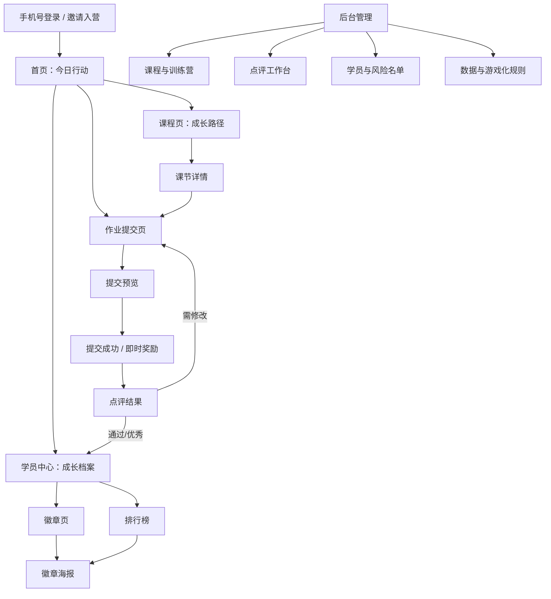
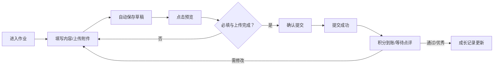
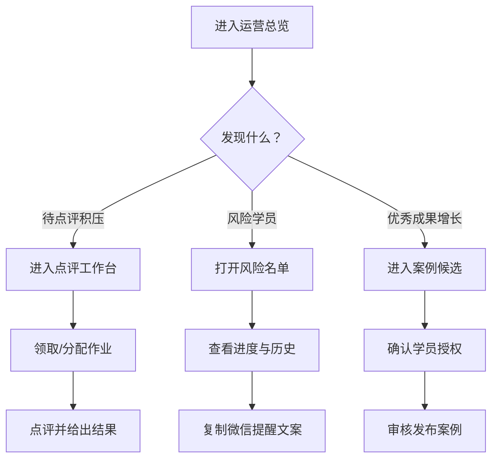
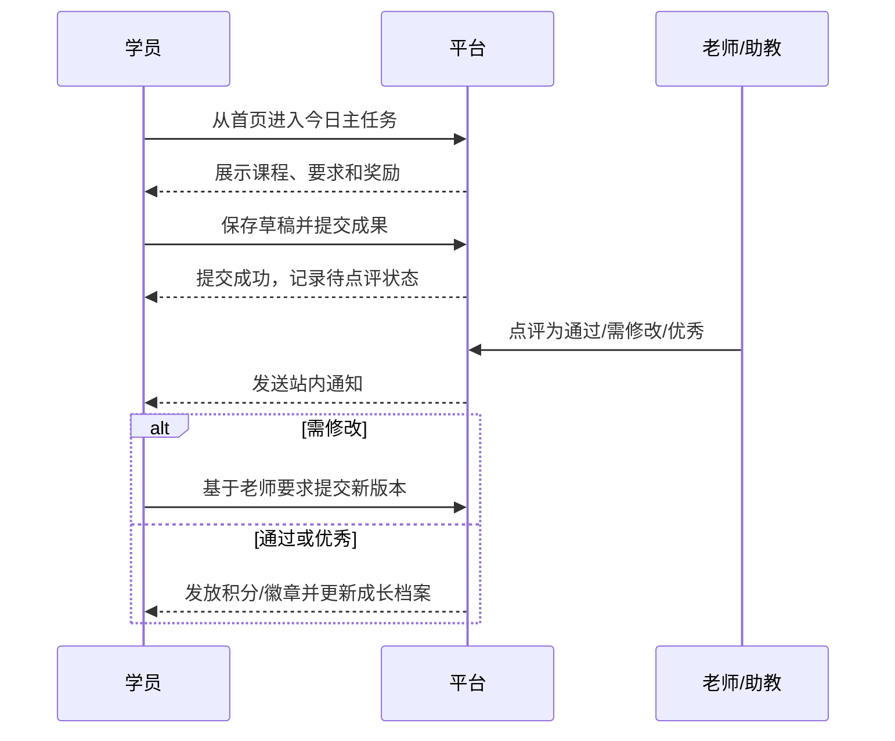

# 游戏化训练营平台低保真原型规格（A 方案）

> 日期：2026-06-23  
> 阶段：产品原型，不包含开发代码  
> 设计方向：成果成长型；移动端优先；参考 Keep 的今日行动、Duolingo 的小步任务与即时奖励、航海系统的任务—作业—点评闭环。

## 一、设计原则与视觉规范

### 1. 核心体验

1. 首页永远先回答“我今天最应该做什么”。
2. 游戏化服务于成果，不用空签到、无意义动画和末位曝光制造焦虑。
3. 每次关键行动都有即时反馈：保存、提交、通过、升级、获章。
4. 当前节点最突出，已完成节点提供成就感，未解锁节点提供期待感。
5. 学员端 375px 移动屏可完成所有核心流程；后台采用桌面主视图。

### 2. 视觉令牌

| 用途 | 色值 | 使用场景 |
|---|---|---|
| 森林绿 | `#173B2B` | 顶栏、品牌区、深色背景 |
| 行动绿 | `#39A85A` | 主按钮、当前节点、正向趋势 |
| 成功浅绿 | `#8EE29E` | 进度条、完成态、成功反馈 |
| 浅暖灰 | `#F5F7F2` | 页面背景 |
| 成长金 | `#F3C969` | 徽章、前三名、里程碑 |
| 辅助紫 | `#7B6FD0` | 等级、特殊成长内容 |
| 正文色 | `#18231B` | 主要文字 |
| 次级文字 | `#718078` | 时间、说明、辅助信息 |
| 危险色 | `#D65C5C` | 逾期、失败、风险提示 |

- 卡片圆角：16–20px；按钮圆角：12–14px；标签使用胶囊圆角。
- 页面左右安全边距：16px；卡片间距：12px；模块间距：24px。
- 主按钮高度：48px；移动端点击区域不小于 44×44px。
- 图标风格：圆润线性图标；徽章可使用更丰富的插画，不混用多套图标体系。

---

## 二、页面结构图



### 学员端主导航

底部固定五栏：**首页、课程、成长、案例、我的**。

- 排行榜、徽章墙属于“成长”二级页面。
- 作业提交、点评结果属于任务上下文页面，不占主导航。
- 学员中心默认从“成长”进入；个人设置从“我的”进入。

---

## 三、首页原型

### 1. 页面目标

让学员 10 秒内知道今天最重要的行动，并看见行动带来的积分、等级和成果变化。

### 2. 布局图

```text
┌──────────────────────────┐
│ DAY 06 · AI人生操作系统   │
│ 早上好，Jenny 🌱          │
│ 本期进度 ██████░░ 62%     │
├──────────────────────────┤
│ [今日主任务]   22:00截止  │
│ 完成人生说明书·价值观地图  │
│ 预计25分钟 · 完成 +20积分  │
│ [       开始行动 +20      ]│
├────────────┬─────────────┤
│ 🔥 连续6天  │ 🏅 Lv2探索者 │
├────────────┴─────────────┤
│ 待修改作业             1项 │
│ 老师已点评《我的五年愿景》 │
├──────────────────────────┤
│ 刚刚获得                  │
│ 🏆 坚持王 · 连续行动5天    │
└──────────────────────────┘
  首页   课程   成长   案例   我的
```

### 3. 组件清单

- 训练营顶栏：天数、名称、通知入口。
- 问候语与总进度条。
- 今日主任务卡：任务类型、标题、截止时间、预计时长、奖励、主按钮。
- 连续行动卡、当前等级卡。
- 待修改/待完成提醒卡。
- 最新徽章/点评动态卡。
- 底部主导航。
- 提交成功、升级、获章的轻量庆祝层。

### 4. 交互

- 点击“开始行动”直达当前课节或作业，不先进入课程目录。
- 今日有“需修改”作业时，主任务仍保持唯一；修改项作为第二优先级提醒。
- 点击积分、等级、徽章分别进入积分流水、等级地图和徽章墙。
- 完成当日主任务后，主卡切换为完成态，并推荐下一步或案例学习。
- 无今日任务时显示“今天已完成”，不制造虚假待办。

---

## 四、学员中心原型

### 1. 页面目标

把学习过程转化为个人成长档案，集中展示身份、等级、成果和下一阶段目标。

### 2. 布局图

```text
┌──────────────────────────┐
│ [头像] Jenny              │
│ Lv2 探索者 · 入营第6天     │
├──────────────────────────┤
│ 268积分   4徽章   2优秀成果 │
│ 距 Lv3 架构师还差 32 分     │
│ ███████░░ 68%             │
├──────────────────────────┤
│ 我的成长轨迹               │
│ ✓ 人生说明书 · 已完成/优秀  │
│ ● 第二大脑 · 进行中 3/5     │
│ 🔒 AI知识库 · 尚未解锁       │
├──────────────────────────┤
│ 最近成果                   │
│ 人生价值观地图 · 优秀案例 ＞ │
│ 五年愿景 V2 · 已通过      ＞ │
├──────────────────────────┤
│ [查看成长报告] [生成海报]   │
└──────────────────────────┘
```

### 3. 组件清单

- 身份头图：头像、昵称、等级、入营天数。
- 成长数据三宫格：积分、徽章、优秀成果。
- 等级进度条与下一等级提示。
- 模块成长轨迹：完成、当前、锁定三态。
- 最近成果列表。
- 成长报告和海报入口。
- 积分流水、证书和个人隐私入口。

### 4. 交互

- 点击成长节点进入对应模块；锁定节点弹出明确解锁条件。
- 点击成果进入作业与点评详情，不直接公开。
- 生成海报前选择公开字段：昵称/匿名、积分、排名、成果数量。
- 学员只能看到自己的私密成长数据。

---

## 五、课程页原型

### 1. 页面目标

用一条清晰的纵向成长路径代替普通课程列表，让学员理解当前位置、前置关系和阶段奖励。

### 2. 布局图

```text
┌──────────────────────────┐
│ 模块01 · 人生说明书       │
│ 进度 ██████░░ 3/5        │
├──────────────────────────┤
│ ✓ 认识人生操作系统         │
│   图文 · 8分钟       [完成] │
│          │               │
│ ✓ 找到你的价值排序         │
│   视频 · 16分钟      [完成] │
│          │               │
│ ▶ 绘制价值观地图           │
│   当前任务 · 25分钟         │
│   [       继续学习        ] │
│          │               │
│ 🔒 我的五年愿景            │
│   完成当前作业后解锁         │
│          │               │
│ 🏆 人生说明书发布           │
│   模块里程碑任务             │
├──────────────────────────┤
│ 完成本模块：觉醒者徽章 +60分 │
└──────────────────────────┘
```

### 3. 组件清单

- 模块头图与模块进度。
- 纵向路径线。
- 课节节点：完成、当前、未开始、锁定、里程碑。
- 内容类型、预计时长和任务状态标签。
- 当前节点主按钮。
- 阶段奖励卡。
- 模块切换器。

### 4. 交互

- 页面自动定位到当前节点，允许向上查看历史、向下预览未来。
- 已完成节点可重复学习，但不重复奖励积分。
- 锁定节点可点击查看条件，不允许绕过前置任务。
- 统一开营未到解锁时间时显示日期；随到随学显示“入营第 N 天解锁”。
- 课程完成由学员主动确认；必交作业通过后才视为模块完成。

---

## 六、作业提交页原型

### 1. 页面目标

降低复杂作业的提交阻力，避免内容丢失，并让要求、示例和截止规则始终清楚。

### 2. 布局图

```text
┌──────────────────────────┐
│ 作业03 · 必交              │
│ 我的价值观地图             │
│ 今日22:00截止 · +20积分     │
├──────────────────────────┤
│ 任务要求         [查看示例] │
│ 1. 写出5个核心价值观        │
│ 2. 说明它们如何影响选择      │
│ 3. 上传一张价值观地图        │
├──────────────────────────┤
│ 文字说明 *                 │
│ ┌──────────────────────┐ │
│ │ 写下思考与结论……       │ │
│ └──────────────────────┘ │
│ ✓ 草稿已自动保存     0/2000 │
├──────────────────────────┤
│ 成果附件 *                 │
│ [ + 上传图片 / 视频 / 文件 ]│
│ 上传进度 / 重试 / 删除       │
├──────────────────────────┤
│ 成果链接（选填）             │
│ [ https://               ] │
├──────────────────────────┤
│ [       预览并提交         ] │
└──────────────────────────┘
```

### 3. 组件清单

- 任务信息头：必交、截止、迟交规则、积分。
- 可折叠任务说明与案例入口。
- 多行文本编辑器、字数统计、自动保存状态。
- 图片、视频、文件上传器及进度状态。
- 链接输入与格式校验。
- 草稿、预览、正式提交按钮。
- 提交确认层与成功反馈层。
- 历史版本、点评与修改说明。

### 4. 交互流程



- 文字输入停止后自动保存，并显示“保存中/已保存/保存失败重试”。
- 附件未上传完成时禁止提交；失败附件保留并支持单项重试。
- 提交前展示最终预览和是否迟交；提交后明确是否允许撤回。
- “需修改”时在顶部固定显示老师要求，并创建新版本，不覆盖旧版本。

---

## 七、排行榜原型

### 1. 页面目标

通过同伴激励推动成果，而不是公开羞辱低排名学员。

### 2. 布局图

```text
┌──────────────────────────┐
│ AI人生操作系统创造营  🏆  │
│ 本周成果榜                │
│ [ 周榜 ]       [ 总榜 ]   │
├──────────────────────────┤
│       🥇 林晓 345         │
│ 🥈 小雨 310   🥉 阿哲 298 │
├──────────────────────────┤
│ 4  木木       286         │
│ 5  Jenny（我）268  ←高亮  │
│    距上一名 18 分          │
│ 6  远山       255         │
│ 7  知夏       243         │
├──────────────────────────┤
│ 如何提升排名？             │
│ 修改作业 +10 · 获评优秀 +20│
│ [     去完成今日任务      ] │
└──────────────────────────┘
```

### 3. 组件清单

- 周榜/总榜切换。
- 前三名领奖台。
- 我的附近排名列表。
- 本人高亮卡、与上一名分差。
- 积分构成说明。
- 匿名展示开关。
- 排名海报入口。

### 4. 交互

- 默认进入周榜与“我的附近”；主动点击后才展开完整榜单。
- 榜单显示成果积分、优秀成果数等正向信息，不显示连续失败。
- 同分时依次比较优秀成果数、按时提交数、达到分数时间。
- 点击学员仅查看其授权公开的成果，不展示私密进度。
- 周榜每周重置，总积分和等级不重置。

---

## 八、徽章页原型

### 1. 页面目标

让徽章成为真实能力与里程碑的证明，而不是无意义收藏品。

### 2. 布局图

```text
┌──────────────────────────┐
│ 成长中心                  │
│ 我的徽章墙 · 已获得 4/8    │
├──────────────────────────┤
│ 🏆 最新获得：坚持王         │
│ 连续有效学习5天             │
│ [      生成徽章海报       ] │
├──────────────────────────┤
│ 已获得                     │
│ 🌅觉醒者  🏗人生架构师  🔥坚持王│
├──────────────────────────┤
│ 即将获得                   │
│ ⚗️ 知识炼金师      3/5     │
│ ██████░░ 60%             │
├──────────────────────────┤
│ 尚未解锁                   │
│ 🤖分身创造者 ✍内容创造者 💎超级个体│
└──────────────────────────┘
```

### 3. 组件清单

- 徽章墙头部与完成比例。
- 最新徽章大卡。
- 已获得徽章网格。
- 进行中徽章与条件进度。
- 未解锁徽章灰态。
- 徽章详情弹层：意义、规则、获得日期、关联成果。
- 徽章海报生成入口。

### 4. 交互

- 获章后使用轻量动效，允许跳过，不阻塞当前任务。
- 点击已获得徽章查看获得证据与生成海报。
- 点击未获得徽章显示明确条件和可执行入口。
- 人工撤销徽章时保留审计记录，学员端不再展示。

---

## 九、后台管理原型

### 1. 页面目标

让主理人一眼掌握成果产出、点评积压与风险学员，并从数据直接进入处理动作。

### 2. 桌面布局图

```text
┌──────────────────────────────────────────────────────────────┐
│ Jenny训练营后台          当前训练营⌄        🔔  Jenny         │
├─────────────┬────────────────────────────────────────────────┤
│ 数据总览     │ 运营总览                         [导出数据]    │
│ 训练营管理   │ ┌────────┬────────┬────────┬────────┐         │
│ 课程与任务   │ │激活 86 │提交78% │优秀 24 │待点评12│         │
│ 点评工作台 12│ └────────┴────────┴────────┴────────┘         │
│ 学员管理     │ ┌──────────────────┬──────────────────┐       │
│ 游戏化规则   │ │ 成果漏斗          │ 风险学员 8人      │       │
│ 案例库       │ │ 登录→提交→通过→优秀│ 未行动5 / 逾期3   │       │
│ 海报与证书   │ └──────────────────┴──────────────────┘       │
│ 设置         │ 点评队列                         [进入工作台] │
│              │ 作业        学员      状态       等待时间     │
│              │ 价值观地图  小雨      修改重提   2小时        │
└─────────────┴────────────────────────────────────────────────┘
```

### 3. 后台信息架构

- 数据总览：核心指标、成果漏斗、趋势、风险、点评队列。
- 训练营管理：批次、开营模式、日历、入营邀请、状态。
- 课程与任务：课程模板、章节、课节、任务、解锁与截止。
- 点评工作台：待点评、修改重提、已超时、助教分配。
- 学员管理：导入、分组、标签、进度、运营备注。
- 游戏化规则：积分、等级、徽章、排行榜规则版本。
- 案例库：候选、授权、审核、发布、撤回。
- 海报与证书：模板、生成记录、验证编号。
- 设置：品牌、团队权限、短信、协议、审计日志。

### 4. 核心组件

- 顶部训练营切换器、通知与账号菜单。
- 左侧功能导航及待处理数字徽标。
- 指标卡、趋势图、成果漏斗、风险卡。
- 数据表格、筛选器、批量操作栏、分页器。
- 点评队列与任务详情抽屉。
- 学员详情侧栏。
- 危险操作确认弹窗、规则版本发布弹窗。

### 5. 管理交互流程



- 指标卡必须可下钻，不提供没有后续动作的“装饰性数据”。
- 待点评默认按超时、修改重提、临近截止、新提交排序。
- 两位助教同时打开同一作业时显示占用状态，避免重复点评。
- 积分规则、等级阈值发布后锁定为版本；调整必须创建新版本。
- 高风险操作必须二次确认，并进入审计日志。

---

## 十、全局交互与状态

### 1. 主学习闭环



### 2. 全局反馈

- 加载：骨架屏，不使用整页旋转图标。
- 空状态：解释原因并提供一个下一步动作。
- 保存：显示“保存中—已保存—保存失败重试”。
- 上传：逐文件显示进度、成功、失败与重试。
- 网络异常：保留本地输入，恢复后提示继续提交。
- 权限不足：说明当前角色和可联系对象，不展示无效按钮。
- 成功：短动效 + 明确结果；不阻塞继续学习。
- 危险操作：说明影响范围，需二次确认。

### 3. 响应式规则

- 学员端：单列布局，卡片全宽，底部固定导航。
- 平板：课程内容可升级为内容 + 目录双栏；主流程仍保持单主按钮。
- 后台桌面：左侧固定导航；内容区 12 栅格；宽度低于 1024px 时指标卡两列。
- 后台移动：只开放数据概览、风险名单和轻量点评；课程编辑提示转桌面端。

---

## 十一、原型验收清单

- 首页首屏只有一个视觉主按钮。
- 学员能在 10 秒内找到今日任务，在 3 次点击内开始提交作业。
- 作业文本和附件状态可恢复、可重试、可追溯。
- 排行榜默认不展示用户处于全榜末位。
- 徽章均能解释“为什么获得、还差什么、对应什么成果”。
- 后台每个核心指标均可下钻到具体学员、任务或作业。
- 移动端 375px 无横向滚动；主要点击区域不小于 44px。
- 色彩之外同时使用文字或图标表达状态。
- 空状态、弱网、迟交、需修改、锁定、无权限均有明确反馈。
